# Physical-Design-Using-Openlane
## Table of Contents
- [Day - 1 Inception of Open-Source EDA, OpenLane and Sky130 PDK](#day---1-inception-of-open-source-eda-openlane-and-sky130-pdk)
- [Day - 2 Good Floor plan Vs Bad floor plan](#day---2-good-floorplan-vs-bad-floorplan-and-introduction-to-libraryt-cells)
- [Day - 3 Design Library Cells using magic](#day--3-design-library-cell-using-magic-layout-and-ngspice-charcterization)
- [Day - 4 Timing Analysis and Clock Tree Synthesis](#day-4-timing-analysis-and-clock-tree-synthesis-cts)
- [Day - 5 Final Steps in RTL2GDS](#day-5--final-steps-in-rtl2gds)
- [Acknowledgement](#acknowledgement)
- [References](#references)

## Day - 1 Inception of Open-Source EDA, OpenLane and Sky130 PDK
### Introduction to RISC-V
RISC-V is an open-source instruction set architecture (ISA) that is adopted in the world of computer architecture and processor design. It was originally developed at the University of California, Berkeley in 2010 and has since grown into a global collaboration of researchers and industry experts. The key characteristic of RISC-V is its simplicity and modularity. It follows the Reduced Instruction Set Computer (RISC) design philosophy, which emphasizes a small and streamlined set of instructions that are easy to decode and execute. RISC-V offers a base set of instructions, called the "RV32I," which provides essential operations for general-purpose computing. Additional optional instruction sets, such as RV32F for single-precision floating-point operations or RV64G for 64-bit computing, can be added to meet specific application requirements. One of the major advantages of RISC-V is its open nature. The ISA specifications, reference implementations, and software tools are freely available, allowing anyone to study, modify, or implement their own RISC-V processors without licensing fees or restrictions. This openness has fostered a vibrant ecosystem of hardware designers, software developers, and researchers who collaborate and innovate around the RISC-V architecture.

### How the software applications run on the hardware ?
All the software applications we use in our daily lives rely on hardware to run. The system software is responsible for translating the application program into binary language, which the hardware can understand and execute. The primary components of system software include the Operating System (OS), Compiler, and Assembler. The OS plays a crucial role in managing various aspects of the computer system. It provides an environment for the application program to run and handles tasks such as memory management, process scheduling, and input/output operations. Depending on the underlying architecture, such as MIPS, x86, x64, or RISC-V, the OS translates the application program into assembly language instructions. The compiler is responsible for converting high-level programming languages, like C or Java, into assembly-level language instructions. This translation process is influenced by the specific architecture on which the software will be executed. Different architectures have their own instruction sets, and the compiler ensures that the instructions generated are compatible with the targeted architecture. Once the code is in assembly language, the assembler comes into play. It takes the assembly code and translates it into binary code, which is a sequence of 0s and 1s that can be directly dumped into the hardware.

### Open-Source Digital ASIC Design

Designing Application Specific Integraded Circuits (ASICs) basically requires three elements : RTL IPs, EDA Tools and PDKs.

**RTL IPs**, or Register Transfer Level Intellectual Property, refer to pre-designed and pre-verified digital hardware components or blocks that are described at the Register Transfer Level (RTL). RTL is a hardware description language (HDL) representation of a digital circuit or a portion of a circuit. In the context of integrated circuit (IC) design, an IP refers to a reusable building block that can be integrated into a larger design. RTL IPs, specifically, are designed at the register transfer level, which represents the flow of data between registers and the operations performed on that data.These IPs can be licensed from IP vendors or developed in-house. They provide a level of abstraction that allows designers to focus on higher-level design aspects rather than implementing low-level details from scratch. RTL IPs offer various advantages, such as improved productivity, faster time-to-market, and increased design reliability. By using RTL IPs, designers can leverage optimized and well-tested building blocks, reducing the likelihood of errors and bugs. Additionally, using RTL IPs promotes design reuse, enabling designers to create complex systems by assembling and integrating different IP blocks.

**EDA (Electronic Design Automation) tools** are software applications used in the design, development, and analysis of electronic systems, including integrated circuits (ICs), printed circuit boards (PCBs), and other electronic components. These tools automate various tasks involved in the design process, increasing efficiency and reducing time-to-market.

**Process Design Kit (PDK)** is a set of files used within the semiconductor industry to model a fabrication process for the design tools used to design an integrated circuit.  PDK’s are often specific to a foundry, and may be subject to a non-disclosure agreement.  While most PDK’s are proprietary to a foundry, certain PDKs are opensource and entirely within the public domain.Traditionally, PDKs have been proprietary and provided by semiconductor foundries, limiting access and customization options for IC designers. However, open-source PDKs aim to promote collaboration, innovation, and accessibility by making the design kit freely available to the community. By providing an open-source PDK, designers can modify and customize the kit to suit their specific requirements. This flexibility allows for greater innovation, collaboration, and knowledge sharing within the design community. It also lowers the barriers to entry for new designers and encourages participation in the development of new ICs and electronic systems. Some of the  open-source PDKs are : SKY130, GFU180, ASAP7 etc

### Simplified RTL to GDSII flow 

The RTL to GDSII flow basically involves :
1. **RTL Design** -  The process begins with the RTL design phase, where the digital circuit is described using a hardware description language (HDL) like VHDL or Verilog. The RTL description captures the functional behavior of the circuit, specifying its logic and data paths.

2. **RTL Synthesis** - RTL synthesis converts the high-level RTL description into a gate-level netlist. This stage involves mapping the RTL code to a library of standard cells (pre-designed logic elements) and optimizing the resulting gate-level representation for area, power, and timing. The output of RTL synthesis is typically in a format called the gate-level netlist.

3. **Floor and Power Planning** - is a crucial step in the digital design flow that involves partitioning the chip's area and determining the placement of major components and functional blocks. It establishes an initial high-level layout and defines the overall chip dimensions, locations of critical modules, power grid distribution, and I/O placement.The primary goals of floor planning are: Area Partitioning, Power Distribution, Signal Flow and Interconnect Planning, Placement of Key Components, Design Constraints and Optimization.

4. **Placement** - Placement involves assigning the physical coordinates to each gate-level cell on the chip's layout. The placement process aims to minimize wirelength, optimize signal delay, and satisfy design rules and constraints. Modern placement algorithms use techniques like global placement and detailed placement to achieve an optimal placement solution.

5. **Clock Tree Synthesis** - Clock tree synthesis (CTS) is a crucial step in the digital design flow that involves constructing an optimized clock distribution network within an integrated circuit (IC). The primary goal of CTS is to ensure balanced and efficient clock signal distribution to all sequential elements (flip-flops, registers) within the design, minimizing clock skew and achieving timing closure.

6. **Routing** - Routing connects the gates and interconnects on the chip based on the placement information. It involves determining the optimal paths for the wires and vias that carry signals between different components. The routing process needs to adhere to design rules, avoid congestion, and optimize for factors like signal integrity, power, and manufacturability.

7. **Sign-off** - Sign-off analysis refers to the final stage of the electronic design process, where comprehensive verification and analysis are performed to ensure that the design meets all the necessary requirements and specifications. It involves a series of checks and simulations to confirm that the design is ready for fabrication and meets the desired functionality, performance, power, and reliability targets. 

8. **GDSII File Generation** - Once the layout is verified and passes all checks, the final step is to generate the GDSII file format, which represents the complete physical layout of the chip. The GDSII file contains the geometric information necessary for fabrication, including the shapes, layers, masks, and other relevant details.

### Introduction to OpenLANE
OpenLane is an automated RTL to GDSII flow based on several components including OpenROAD, Yosys, Magic, Netgen, CVC, SPEF-Extractor, KLayout and a number of custom scripts for design exploration and optimization. It also provides a number of custom scripts for design exploration and optimization. The flow performs all ASIC implementation steps from RTL all the way down to GDSII. Currently, it supports both A and B variants of the sky130 PDK, the C variant of the gf180mcu PDK, and instructions to add support for other (including proprietary) PDKs are documented. OpenLane abstracts the underlying open source utilities, and allows users to configure all their behavior with just a single configuration file.

OpenLane integrated several key open source tools over the execution stages:
1. RTL Synthesis, Technology Mapping, and Formal Verification : yosys + abc
2. Static Timing Analysis: OpenSTA
3. Floor Planning: init_fp, ioPlacer, pdn and tapcell
4. Placement: RePLace (Global), Resizer and OpenPhySyn (formerly), and OpenDP (Detailed)
5. Clock Tree Synthesis: TritonCTS
6. Fill Insertion: OpenDP/filler_placement
7. Routing: FastRoute or CU-GR (formerly) and TritonRoute (Detailed) or DR-CU
8. SPEF Extraction: OpenRCX or SPEF-Extractor (formerly)
9. GDSII Streaming out: Magic and KLayout
10. DRC Checks: Magic and KLayout
11. LVS check: Netgen
12. Antenna Checks: Magic
13. Circuit Validity Checker: CVC


### OpenLane Installation
Prior to the installation of the OpenLane install the dependencies and packages using the command shown below :</br>
``` 
sudo apt-get update
sudo apt-get upgrade
sudo apt install -y build-essential python3 python3-venv python3-pip make git
```
Docker Installation :</br>
```
sudo apt install apt-transport-https ca-certificates curl software-properties-common
curl -fsSL https://download.docker.com/linux/ubuntu/gpg | sudo gpg --dearmor -o /usr/share/keyrings/docker-archive-keyring.gpg

echo "deb [arch=amd64 signed-by=/usr/share/keyrings/docker-archive-keyring.gpg] https://download.docker.com/linux/ubuntu $(lsb_release -cs) stable" | sudo tee /etc/apt/sources.list.d/docker.list > /dev/null

sudo apt update
sudo apt install docker-ce docker-ce-cli containerd.io
sudo docker run hello-world

sudo groupadd docker
sudo usermod -aG docker $USER
sudo reboot 


# Check for installation
sudo docker run hello-world
```

**Steps to install OpenLane, PDKs and Tools**</br>
```
cd $HOME
git clone https://github.com/The-OpenROAD-Project/OpenLane --recurse-submodules 
cd OpenLane
make
make test
cd /home/kanish/OpenLane/designs/ci
cp -r * ../
```

### Steps to run synthesis in OpenLane:


```
cd ~/OpenLane
make mount
./flow.tcl -interactive
package require openlane 0.9
prep -design picorv32a
run_synthesis
```
To view nelist
```
cd /home/kanish/OpenLane/designs/picorv32a/runs/RUN_2023.09.08_13.53.29/results/synthesis
vim picorv32a.v
```
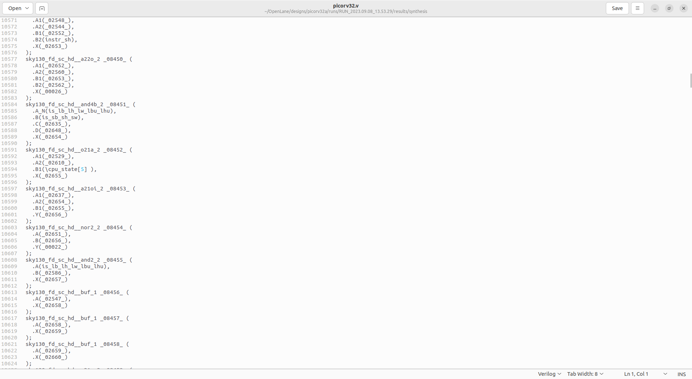

To view the report:
```
cd /home/kanish/OpenLane/designs/picorv32a/runs/RUN_2023.09.08_13.53.29/reports/synthesis
vim 1-synthesis.AREA_0.stat.rpt
```
```
Synthesis Report
=================


   Number of wires:               9824
   Number of wire bits:          10206
   Number of public wires:        1512
   Number of public wire bits:    1894
   Number of memories:               0
   Number of memory bits:            0
   Number of processes:              0
   Number of cells:              10104
     sky130_fd_sc_hd__a2111o_2       2
     sky130_fd_sc_hd__a211o_2      101
     sky130_fd_sc_hd__a211oi_2       4
     sky130_fd_sc_hd__a21bo_2       19
     sky130_fd_sc_hd__a21boi_2       7
     sky130_fd_sc_hd__a21o_2       414
     sky130_fd_sc_hd__a21oi_2      127
     sky130_fd_sc_hd__a221o_2       65
     sky130_fd_sc_hd__a221oi_2       1
     sky130_fd_sc_hd__a22o_2       197
     sky130_fd_sc_hd__a22oi_2        2
     sky130_fd_sc_hd__a2bb2o_2      16
     sky130_fd_sc_hd__a311o_2       38
     sky130_fd_sc_hd__a31o_2        90
     sky130_fd_sc_hd__a31oi_2       10
     sky130_fd_sc_hd__a32o_2        89
     sky130_fd_sc_hd__a41o_2         2
     sky130_fd_sc_hd__and2_2       283
     sky130_fd_sc_hd__and2b_2       32
     sky130_fd_sc_hd__and3_2        77
     sky130_fd_sc_hd__and3b_2       76
     sky130_fd_sc_hd__and4_2        46
     sky130_fd_sc_hd__and4b_2        6
     sky130_fd_sc_hd__and4bb_2       3
     sky130_fd_sc_hd__buf_1       2735
     sky130_fd_sc_hd__buf_2         16
     sky130_fd_sc_hd__conb_1       106
     sky130_fd_sc_hd__dfxtp_2     1596
     sky130_fd_sc_hd__inv_2         83
     sky130_fd_sc_hd__mux2_2      1817
     sky130_fd_sc_hd__mux4_2       323
     sky130_fd_sc_hd__nand2_2      250
     sky130_fd_sc_hd__nand2b_2       2
     sky130_fd_sc_hd__nand3_2       18
     sky130_fd_sc_hd__nand3b_2       3
     sky130_fd_sc_hd__nand4_2        2
     sky130_fd_sc_hd__nor2_2       185
     sky130_fd_sc_hd__nor3_2        11
     sky130_fd_sc_hd__nor3b_2        3
     sky130_fd_sc_hd__nor4_2         4
     sky130_fd_sc_hd__nor4b_2        3
     sky130_fd_sc_hd__o2111a_2       1
     sky130_fd_sc_hd__o211a_2      224
     sky130_fd_sc_hd__o211ai_2       6
     sky130_fd_sc_hd__o21a_2       154
     sky130_fd_sc_hd__o21ai_2       94
     sky130_fd_sc_hd__o21ba_2       15
     sky130_fd_sc_hd__o21bai_2       3
     sky130_fd_sc_hd__o221a_2       19
     sky130_fd_sc_hd__o221ai_2       1
     sky130_fd_sc_hd__o22a_2        26
     sky130_fd_sc_hd__o22ai_2        1
     sky130_fd_sc_hd__o2bb2a_2       7
     sky130_fd_sc_hd__o311a_2       31
     sky130_fd_sc_hd__o311ai_2       2
     sky130_fd_sc_hd__o31a_2        21
     sky130_fd_sc_hd__o31ai_2        2
     sky130_fd_sc_hd__o32a_2        14
     sky130_fd_sc_hd__o41a_2         1
     sky130_fd_sc_hd__or2_2        337
     sky130_fd_sc_hd__or2b_2        20
     sky130_fd_sc_hd__or3_2        102
     sky130_fd_sc_hd__or3b_2        17
     sky130_fd_sc_hd__or4_2         29
     sky130_fd_sc_hd__or4b_2         6
     sky130_fd_sc_hd__xnor2_2       78
     sky130_fd_sc_hd__xor2_2        29

   Chip area for module '\picorv32': 102957.494400

```

```
Flop ratio = Number of D Flip flops = 1596  = 0.1579
             ______________________   _____
             Total Number of cells    10104
```

## Day - 2 Good Floorplan Vs Bad Floorplan and Introduction to Libraryt Cells
### Utilization factor and Aspect ratio


```
Utilization Factor = Area occupied by netlist
                     -------------------------
                      Total area of the core 
```
```
Aspect Ratio = Height of Core
              ----------------
               Width of Core
```
When the aspect ratio is 1, the chip is squared in shape.

### Preplaced Cells
The pre-placed cells are typically larger and more complex modules, such as memory blocks, complex functional units, or other predefined structures that are designed separately and then positioned in the layout before the placement and routing stages. Pre-placed cells are often used for several reasons:Performance optimization, IP integration and Power optimization. The preplaced cells are reused in the designs.These pre-placed cells should be surrounded by de-coupling capacitors. Decoupling capacitors are large capacitors that store electrical charge. They have a voltage across them similar to that of the power supply. When a circuit switches, the decoupling capacitor acts as a power source for the circuit, effectively isolating it from the main power supply. During switching events, the decoupling capacitor supplies the necessary current to the circuit. To minimize voltage drops, these capacitors are positioned in close proximity to the circuit. They ensure that the circuit receives the required current during switching operations. The purpose of the decoupling capacitor is to charge the circuit. When a switching activity occurs, the decoupling capacitor transfers some of its charge to the circuit. During periods of no switching activity, the decoupling capacitor replenishes its charge from the power supply.


### Decoupling Capacitor
Decoupling capacitors constitute an indispensable element within the realm of electronic circuit design, particularly in the context of integrated circuits (ICs) and printed circuit boards (PCBs). Their primary purpose revolves around the stabilization of power supply voltage levels, a crucial function in mitigating noise and upholding consistent voltage for delicate components. As electronic apparatuses operate at elevated frequencies, abrupt shifts in current demands can incite voltage fluctuations and unwanted noise, thereby resulting in performance dilemmas and signal deterioration. Decoupling capacitors, akin to a safeguard, establish a local storehouse of electrical charge that can swiftly respond to these fluctuations. Essentially, they act as reservoirs, storing and disbursing electrical energy as required, effectively sieving out undesirable noise and voltage oscillations. 

Decoupling capacitors are strategically sited in close proximity to power-thirsty constituents, such as microprocessors, digital logic circuits, or high-speed memory modules, where they adeptly soak up and provide instant current requisites. Through curbing voltage fluctuations, they heighten the overall fidelity of signals and prevent potential issues like ground disturbance, signal interference, and electromagnetic perturbations. The physical configuration of decoupling capacitors necessitates judiciously determining the appropriate capacitance magnitude, voltage rating, and package dimensions based on the distinct requisites of the circuit. The capacitance value must adequately meet current necessities and the frequency spectrum of the circuit. Greater capacitance values promise superior noise suppression but can introduce bulkier physical dimensions and cost ramifications. Furthermore, the placement of decoupling capacitors assumes paramount importance, requiring them to be positioned as proximate as feasible to the power and ground pins of the targeted components, thereby minimizing inductance and resistance along the supply path. This close proximity ensures efficient energy transmission between the power source and the components, concurrently diminishing impedance and maximizing the capacitor's efficacy.

### Power Planning
Power planning in integrated circuit (IC) design involves the careful consideration and distribution of power and ground connections to ensure proper functionality and performance of the chip. One important aspect of power planning is the placement of multiple ground (GND) and supply voltage (VDD) points throughout the IC layout.The need for multiple GND and VDD points arises due to several reasons:By providing multiple GND and VDD points, the power can be distributed more evenly throughout the chip, reducing the chances of voltage drops and improving overall power delivery efficiency. Ground bounce occurs when there are variations in the voltage levels of different GND points due to transient currents. Similarly, power supply noise refers to fluctuations in the VDD levels caused by switching events. By strategically placing multiple GND and VDD points, the impact of ground bounce and power supply noise can be minimized, improving circuit performance and reducing the risk of functional failures.


### Pin Placement
Pin placement in physical design is all about how and where we put the input/output pins on a chip or circuit board. It's important because it affects how well signals move around, how little they get messed up, and how easy it is to build and test the device. We have to think about things like keeping the signals strong, spreading out power evenly, managing heat, and making sure it fits with standard connectors and packaging. When we do this pin placement right, it makes the electronic system more reliable, easier to build, and more user-friendly.

### Steps to perform Floorplanning and Placement
**Floorplanning**</br>
To perform floor planning
```
run_floorplanning
```
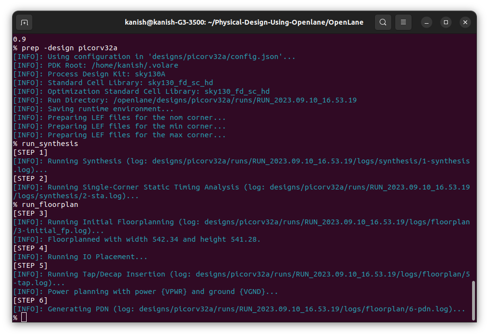

To view the floor planning in magic :
```
cd /home/kanish/Physical-Design-Using-Openlane/OpenLane/designs/picorv32a/runs/RUN_2023.09.10_16.53.19/results/floorplanning
magic -T /home/kanish/.volare/sky130A/libs.tech/magic/sky130A.tech lef read ../../tmp/merged.nom.lef def read picorv32.def &
```
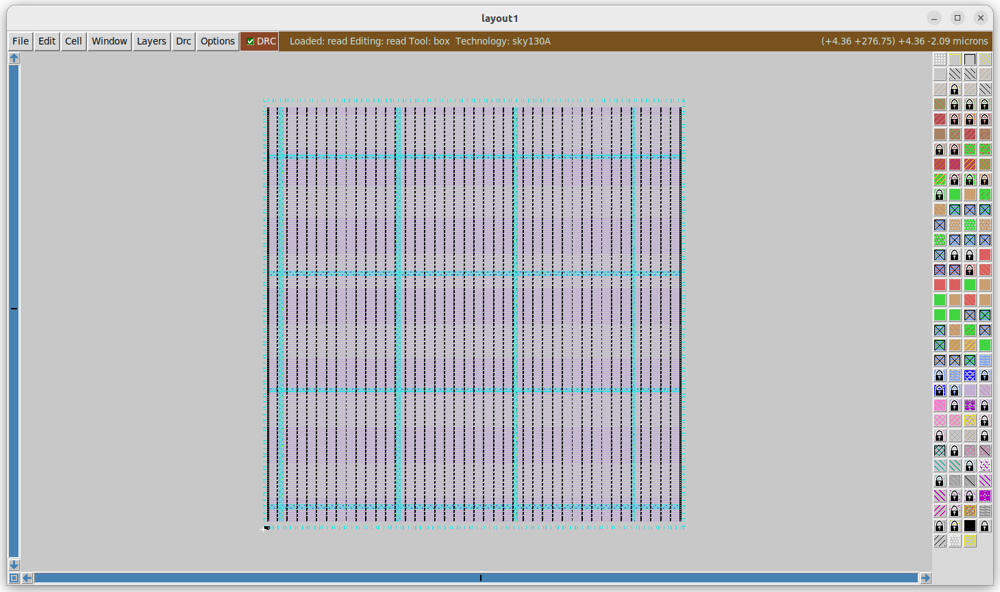

**Placement**</br>
To perform placemnet 
```
run_placement
```
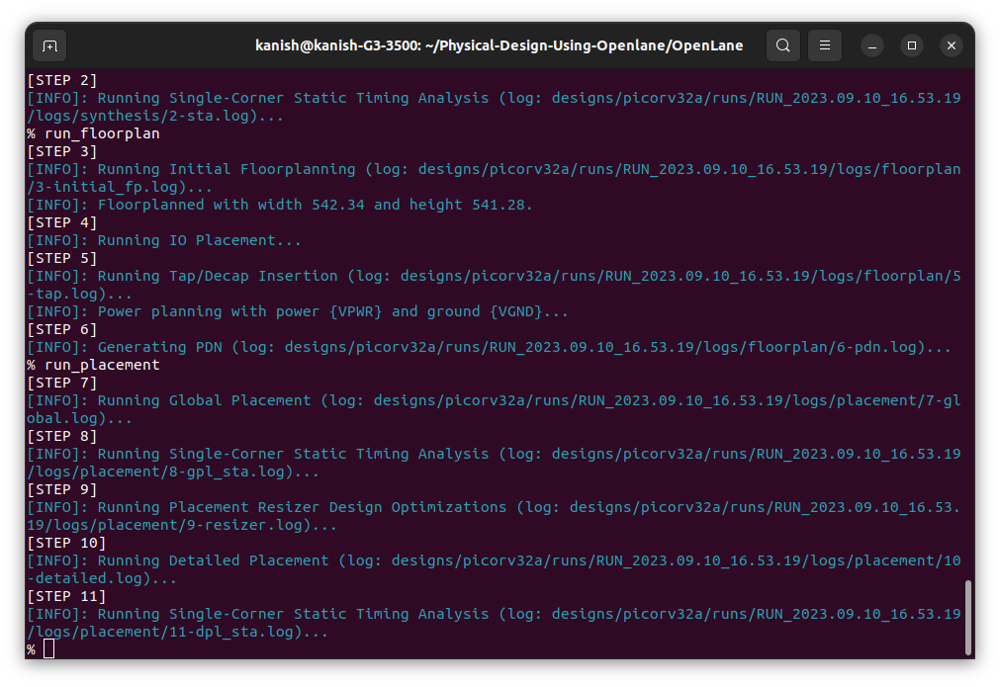
To view the placement in magic :
```
cd /home/kanish/Physical-Design-Using-Openlane/OpenLane/designs/picorv32a/runs/RUN_2023.09.10_16.53.19/results/placement
magic -T /home/kanish/.volare/sky130A/libs.tech/magic/sky130A.tech lef read ../../tmp/merged.nom.lef def read picorv32.def &
```
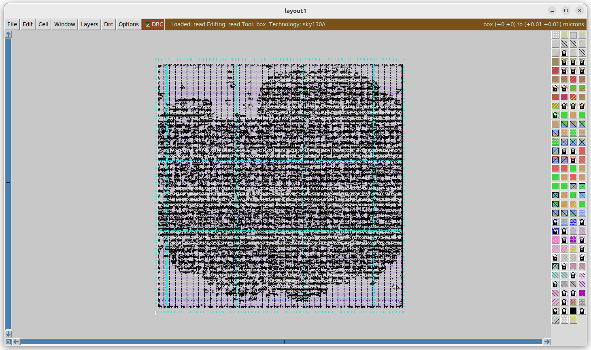

### CELL DESIGN AND CHARACETRIZATION FLOWS

Library is a place where we get information about every cell. It has differents cells with different size, functionality,threshold voltages. There is a typical cell design flow steps.
1. Inputs : PDKS(process design kit) : DRC & LVS, SPICE Models, library & user-defined specs.
2. Design Steps :Circuit design, Layout design (Art of layout Euler's path and stick diagram), Extraction of parasitics, Characterization (timing, noise, power).
3. Outputs: CDL (circuit description language), LEF, GDSII, extracted SPICE netlist (.cir), timing, noise and power .lib files

### Standard Cell Characterization Flow

A typical standard cell characterization flow that is followed in the industry includes the following steps:

1. Read in the models and tech files
2. Read extracted spice Netlist
3. Recognise behavior of the cells
4. Read the subcircuits
5. Attach power sources
6. Apply stimulus to characterization setup
7. Provide neccesary output capacitance loads
8. Provide neccesary simulation commands

Now all these 8 steps are fed in together as a configuration file to a characterization software called GUNA. This software generates timing, noise, power models.
These .libs are classified as Timing characterization, power characterization and noise characterization.


### TIMING CHARACTERIZATION

In standard cell characterisation, One of the classification of libs is timing characterisation.

#### Timing threshold definitions 
Timing defintion |	Value
-------------- | --------------
slew_low_rise_thr	| 20% value
slew_high_rise_thr | 80% value
slew_low_fall_thr |	20% value
slew_high_fall_thr |	80% value
in_rise_thr	| 50% value
in_fall_thr |	50% value
out_rise_thr |	50% value
out_fall_thr | 50% value

#### Propagation Delay and Transition Time 

**Propagation Delay** 
The time difference between when the transitional input reaches 50% of its final value and when the output reaches 50% of its final value. Poor choice of threshold values lead to negative delay values. Even thought you have taken good threshold values, sometimes depending upon how good or bad the slew, the dealy might be still +ve or -ve.

```
Propagation delay = time(out_thr) - time(in_thr)
```
**Transition Time**

The time it takes the signal to move between states is the transition time , where the time is measured between 10% and 90% or 20% to 80% of the signal levels.

```
Rise transition time = time(slew_high_rise_thr) - time (slew_low_rise_thr)

Low transition time = time(slew_high_fall_thr) - time (slew_low_fall_thr)
```

## Day -3 Design Library Cell using magic layout and ngspice charcterization
### Switching Threshold (Vm)
In physical design, the switching threshold Vm is like a critical voltage level for a component called a CMOS inverter. It's the point at which this inverter switches between sending out a "0" or a "1" in a computer chip. This Vm is super important because it decides how well the CMOS inverter works. Now, when we want to see how this CMOS inverter behaves, we do two types of tests. First, we have the static test, where we check how it acts when everything's stable. We look at things like how fast it can send a signal, how much power it uses, and how safe it is against errors. Then, there's the dynamic test, where we see what happens when it's switching on and off. This helps us figure out how quickly it can change from "0" to "1" and back, how strong the signals are, and if there are any weird issues like sudden changes or stuck states. Both these tests are crucial in making sure CMOS inverters work well in computer chips. They help us make sure the chip does its job correctly and efficiently.

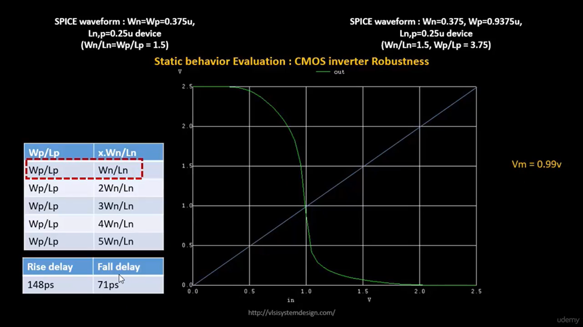

### Steps to view Inverter Layout by VLSI System Design

```
git clone https://github.com/nickson-jose/vsdstdcelldesign.git
```
To view the layout of the inverter in magic :
```
magic -T ./libs/sky130A.tech sky130_inv.mag &
```
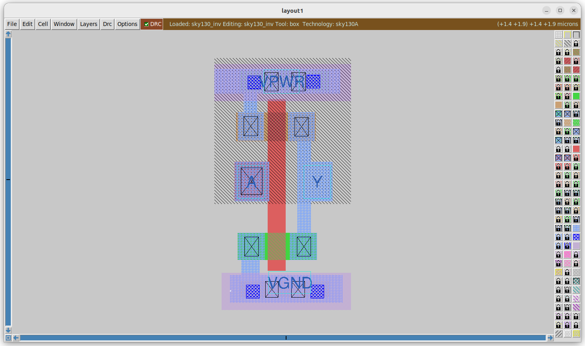

### Summary N-Well Process
The 16-mask CMOS design fabrication process involves several steps to create integrated circuits. Here is a brief description of each step:

1. Substrate Preparation: The process begins with preparing a silicon wafer, which serves as the substrate for the integrated circuit.

2. N-Well Formation: The N-well regions are created on the substrate by introducing impurities, typically phosphorus, through ion implantation or diffusion.

3. P-Well Formation: Similar to the N-well formation, P-well regions are created using ion implantation or diffusion with boron or other suitable dopants.

4. Gate Oxide Deposition: A thin layer of silicon dioxide is deposited on the substrate, forming the gate oxide.

5. Poly-Silicon Deposition: A layer of polysilicon is deposited on the gate oxide layer, which will later serve as the gate electrode.

6. Poly-Silicon Masking and Etching: A photoresist mask is applied to define the areas where the poly-silicon layer needs to be preserved, and then etching is performed to remove the exposed portions.

7. N-Well Masking and Implantation: A photoresist mask is used to define the areas where the N-well regions should be preserved. Phosphorus or other suitable impurities are then implanted into the exposed regions.

8. P-Well Masking and Implantation: Similarly, a photoresist mask is used to define the areas where the P-well regions should be preserved. Boron or other suitable impurities are implanted into the exposed regions.

9. Source/Drain Implantation: The areas for source and drain regions are defined using a photoresist mask, and dopants (e.g., arsenic or phosphorus for NMOS, boron or BF2 for PMOS) are implanted into the exposed regions.

10. Gate Formation: The gate electrode is defined by etching the poly-silicon layer using a photoresist mask.

11. Source/Drain Masking and Etching: A photoresist mask is applied to define the source and drain regions, and etching is performed to remove the oxide layer in those areas.

12. Contact/Via Formation: Contact holes or vias are etched through the oxide layer to expose the underlying regions, such as the source/drain regions or poly-silicon gates.

13. Metal Deposition: A layer of metal, typically aluminum or copper, is deposited on the wafer surface to form the interconnects.

14. Metal Masking and Etching: A photoresist mask is used to define the metal interconnects, and etching is performed to remove the exposed metal, leaving behind the desired interconnect patterns.

15. Passivation Layer Deposition: A protective layer, often made of silicon dioxide or nitride, is deposited to isolate and shield the metal interconnects.

16. Final Testing and Packaging: The fabricated wafer undergoes rigorous testing to ensure the functionality of the integrated circuits. The working chips are then separated, packaged, and prepared for use in various electronic devices.
Each of these steps plays a crucial role in the fabrication process, contributing to the successful creation of CMOS integrated circuits with 16 masks.

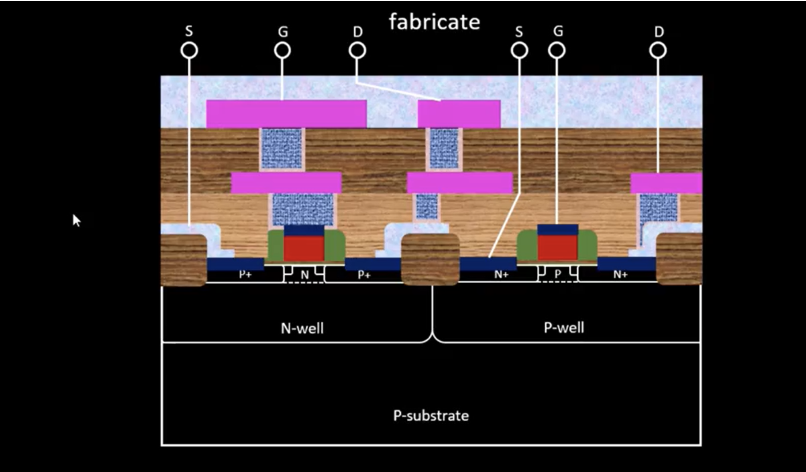

### SPICE extraction from MAGIC
To extract spice netlist from magic use the following command in magic tkon window
```
extract all
ext2spice cthresh 0 rthresh 0
ext2spice
```

ext2spice commands converts the ext file to spice netlist. cthreh and rthresh are the switches to extract all the parasitic resistance and capacitance.
The extracted spice list has to be modified as shown below to use ngspice to perform simulation:
```
* SPICE3 file created from sky130_inv.ext - technology: sky130A

.option scale=0.01u
.include ./libs/pshort.lib
.include ./libs/nshort.lib

//.subckt sky130_inv A Y VPWR VGND
M1000 Y A VGND VGND nshort_model.0 w=35 l=23
+  ad=1.44n pd=0.152m as=1.37n ps=0.148m
M1001 Y A VPWR VPWR pshort_model.0 w=37 l=23
+  ad=1.44n pd=0.152m as=1.52n ps=0.156m

VDD VPWR 0 3.3V
VSS VGND 0 0V
Va A VGND PULSE(0V 3.3V 0 0.1ns 0.1ns 2ns 4ns)

C0 A VPWR 0.0774f
C1 VPWR Y 0.117f
C2 A Y 0.0754f
C3 Y VGND 2f
C4 A VGND 0.45f
C5 VPWR VGND 0.781f
//.ends

.tran 1n 20n
.control
run
.endc
.end
```

To simulate the spice netlist type the following command in the terminal:
```
ngspice sky130_inv.spice
```
To plot the wave form type
```
plot y vs time a
```
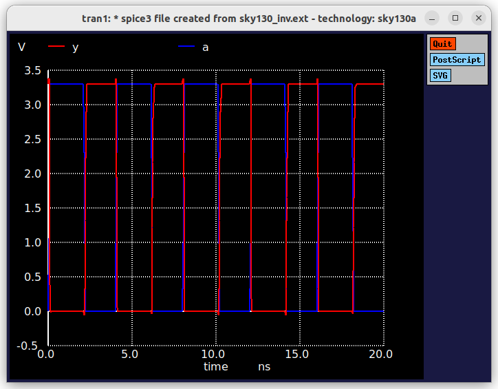

characterization of the inverter standard cell depends on Four timing parameters
 
 **Rise Transition**: Time taken for the output to rise from 20% to 80% of max value

 **Fall Transition**: Time taken for the output to fall from 80% to 20% of max value

 **Cell Rise delay**: difference in time(50% output rise) to time(50% input fall)
 
 **Cell Fall delay**: difference in time(50% output fall) to time(50% input rise)
 
 The above timing parameters can be computed by noting down various values from the ngspice waveform.
 
 ``` 
 Rise Transition : 2.25421 - 2.18636 = 0.006785 ns / 67.85ps
 ```
 ```
 Fall Transitio : 4.09605 - 4.05554 = 0.04051ns/40.51ps 
 ```
 ```
 Cell Rise Delay : 2.21701 - 2.14989 = 0.06689ns/66.89ps 
 ```
 ```
 Cell Fall Delay : 4.07816 - 4.05011 = 0.02805ns/28.05ps 
 ```


## DAY 4  Timing Analysis and Clock Tree Synthesis (CTS)


## Custom cell naming and lef extraction.

Name the custom cell through tkcon window as ```sky130_vsdinv.mag```.

We generate lef file by command:

```
lef write

```
This generates sky130_vsdinv.lef file.


## Steps to include custom cell in ASIC design

We have created a custom standard cell in previous steps of an inverter. Copy lef file, sky130_fd_sc_hd_typical.lib, sky130_fd_sc_hd_slow.lib & sky130_fd_sc_hd_fast.lib to src folder of picorv32a from libs folder vsdstdcelldesign. Then modify the config.tcl as follows.

```

# Design
set ::env(DESIGN_NAME) "picorv32a"

set ::env(VERILOG_FILES) "$::env(DESIGN_DIR)/src/picorv32a.v"

set ::env(CLOCK_PORT) "clk"
set ::env(CLOCK_NET) $::env(CLOCK_PORT)

set ::env(GLB_RESIZER_TIMING_OPTIMIZATIONS) {1}

set ::env(LIB_SYNTH) "$::env(OPENLANE_ROOT)/designs/picorv32a/src/sky130_fd_sc_hd__typical.lib"
set ::env(LIB_SLOWEST) "$::env(OPENLANE_ROOT)/designs/picorv32a/src/sky130_fd_sc_hd__slow.lib"
set ::env(LIB_FASTEST) "$::env(OPENLANE_ROOT)/designs/picorv32a/src/sky130_fd_sc_hd__fast.lib"
set ::env(LIB_TYPICAL) "$::env(OPENLANE_ROOT)/designs/picorv32a/src/sky130_fd_sc_hd__typical.lib"

set ::env(EXTRA_LEFS) [glob $::env(OPENLANE_ROOT)/designs/$::env(DESIGN_NAME)/src/*.lef]

set filename $::env(DESIGN_DIR)/$::env(PDK)_$::env(STD_CELL_LIBRARY)_config.tcl
if { [file exists $filename] == 1} {
	source $filename
}

```

To integrate standard cell in openlane flow after `` make mount `` , perform following commands:

```
prep -design picorv32a -tag RUN_2023.09.09_20.37.18 -overwrite 
set lefs [glob $::env(DESIGN_DIR)/src/*.lef]
add_lefs -src $lefs
run_synthesis

```
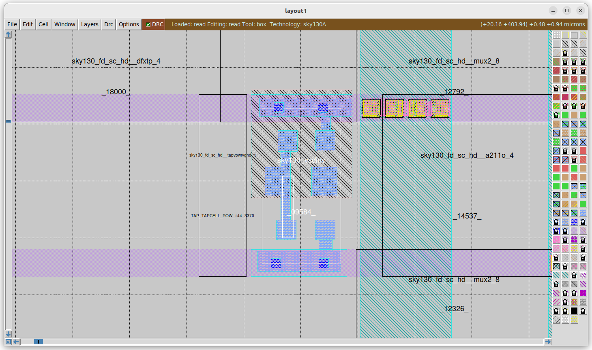

## Delay Tables

Basically, Delay is a parameter that has huge impact on our cells in the design. Delay decides each and every other factor in timing. 
For a cell with different size, threshold voltages, delay model table is created where we can it as timing table.
```Delay of a cell depends on input transition and out load```. 
Lets say two scenarios, 
we have long wire and the cell(X1) is sitting at the end of the wire : the delay of this cell will be different because of the bad transition that caused due to the resistance and capcitances on the long wire.
we have the same cell sitting at the end of the short wire: the delay of this will be different since the tarn is not that bad comapred to the earlier scenario.
Eventhough both are same cells, depending upon the input tran, the delay got chaned. Same goes with o/p load also.

VLSI engineers have identified specific constraints when inserting buffers to preserve signal integrity. They've noticed that each buffer level must maintain consistent sizing, but their delays can vary depending on the load they drive. To address this, they introduced the concept of "delay tables," which essentially consist of 2D arrays containing values for input slew and load capacitance, each associated with different buffer sizes. These tables serve as timing models for the design.

When the algorithm works with these delay tables, it utilizes the provided input slew and load capacitance values to compute the corresponding delay values for the buffers. In cases where the precise delay data is not readily available, the algorithm employs a technique of interpolation to determine the closest available data points and extrapolates from them to estimate the required delay values.
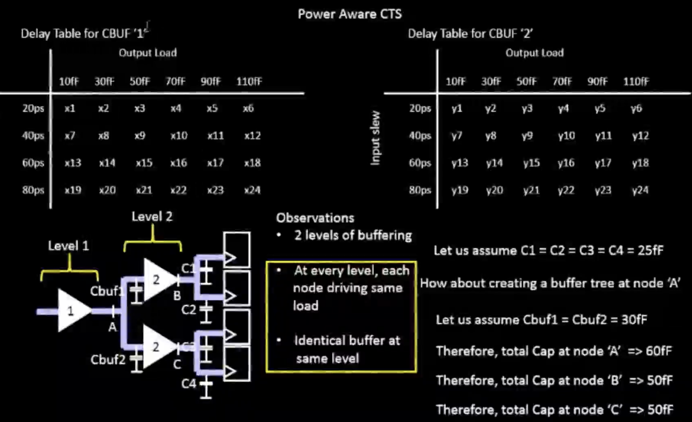

## Openlane steps with custom standard cell

We perform synthesis and found that it has positive slack and met timing constraints.

During Floorplan,``` 504 endcaps, 6731 tapcells ``` got placed. Design has 275 original rows

Now ``` run_placement```

After placement, we check for legality &To check the layout invoke magic from the results/placement directory:

```
magic -T /home/kanish/OpenLane/vsdstdcelldesign/libs/sky130A.tech lef read tmp/merged.nom.lef def read results/floorplan/picorv32a.def &

```


### Post-synthesis timing analysis Using OpenSTA 

Timing analysis is carried out outside the openLANE flow using OpenSTA tool. For this, ```pre_sta.conf``` is required to carry out the STA analysis. Invoke OpenSTA outside the openLANE flow as follows:
 
```
sta pre_sta.conf
```

sdc file for OpenSTA is modified like this:

base.sdc is located in vsdstdcelldesigns/extras directory.
So, I copied it into our design folder using

``` cp my_base.sdc /home/kanish/OpenLane/designs/picorv32a/src/ ```

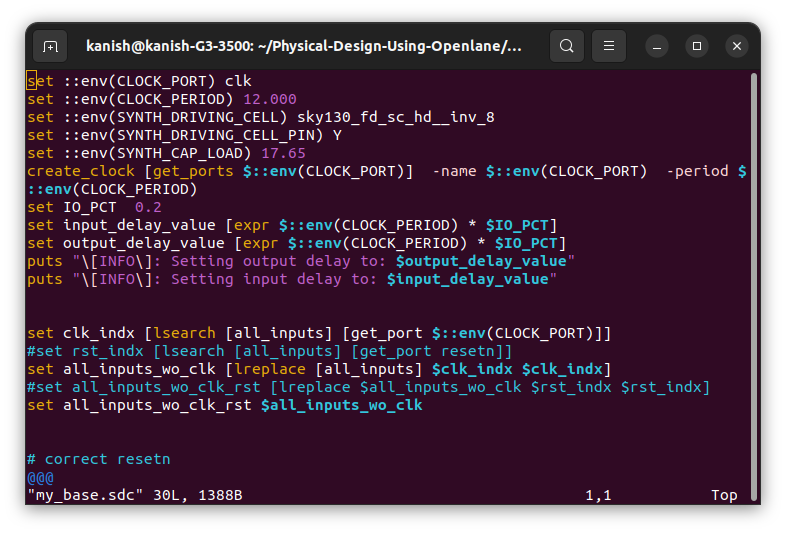

Since I have no Violations I skipped this, but have hands on experience on timing analysis using OpenSTA.

Since clock is propagated only once we do CTS, In placement stage, clock is considered to be ideal. So only setup slack is taken into consideration before CTS.

``` 
Setup time: minimum time required for the data to be stable before the active edge of the clock to get properly captured.

Setup slack : data required time - data arrival time 

```
clock is generated from PLL which has inbuilt circuit which cells and some logic. There might variations in the clock generation depending upon the ckt. These variations are collectivity known as clock uncertainity. In that jitter is one of the parameter. It is uncertain that clock might come at that exact time withought any deviation. That is why it is called clock_uncertainity
Skew, Jitter and Margin comes into clock_uncertainity

```  Clock Jitter : deviation of clock edge from its original position. ```

From the timing report, we can improve slack by upsizing the cells i.e., by replacing the cells with high drive strength and we can see significant changes in the slack.

### Clock Tree Synthesis using Tritoncts

Clock tree synthesis (CTS) can be implemented in various ways, and the choice of the specific technique depends on the design requirements, constraints, and goals. Here are some different types or approaches to clock tree synthesis:

Balanced Tree CTS:
In a balanced tree CTS, the clock signal is distributed in a balanced manner, often resembling a binary tree structure.
This approach aims to provide roughly equal path lengths to all clock sinks (flip-flops) to minimize clock skew.
It's relatively straightforward to implement and analyze but may not be the most power-efficient solution.

H-tree CTS:
An H-tree CTS uses a hierarchical tree structure, resembling the letter "H."
It is particularly effective for distributing clock signals across large chip areas.
The hierarchical structure can help reduce clock skew and optimize power consumption.

Star CTS:
In a star CTS, the clock signal is distributed from a single central point (like a star) to all the flip-flops.
This approach simplifies clock distribution and minimizes clock skew but may require a higher number of buffers near the source.

Global-Local CTS:
Global-Local CTS is a hybrid approach that combines elements of both star and tree topologies.
The global clock tree distributes the clock signal to major clock domains, while local trees within each domain further distribute the clock.
This approach balances between global and local optimization, addressing both chip-wide and domain-specific clocking requirements.

Mesh CTS:
In a mesh CTS, clock wires are arranged in a mesh-like grid pattern, and each flip-flop is connected to the nearest available clock wire.
It is often used in highly regular and structured designs, such as memory arrays.
Mesh CTS can offer a balance between simplicity and skew minimization.

Adaptive CTS:
Adaptive CTS techniques adjust the clock tree structure dynamically based on the timing and congestion constraints of the design.
This approach allows for greater flexibility and adaptability in meeting design goals but may be more complex to implement.

# crosstalk in VLSI:
Impact: Crosstalk is a significant concern in VLSI design due to the high integration density of components on a chip. Uncontrolled crosstalk can lead to data corruption, timing violations, and increased power consumption.
Mitigation: VLSI designers employ various techniques to mitigate crosstalk, such as optimizing layout and routing, using appropriate shielding, implementing proper clock distribution strategies, and utilizing clock gating to reduce dynamic power consumption when logic is idle

# Clock Net Shielding in VLSI:
Purpose: In VLSI circuits, the clock distribution network is crucial for synchronous operation. Clock signals must reach all parts of the chip while minimizing skew and maintaining signal integrity.
Shielding Techniques: VLSI designers may use shielding techniques to isolate the clock network from other signals, reducing the risk of interference. This can include dedicated clock routing layers, clock tree synthesis algorithms, and buffer insertion to manage clock distribution more effectively.
Clock Domain Isolation: VLSI designs often have multiple clock domains. Shielding and proper clock gating help ensure that clock signals do not propagate between domains, avoiding metastability issues and maintaining synchronization.

# Labwork:

In this stage clock is propagated and make sure that clock reaches each and every clock pin from clock source with mininimum skew and insertion delay. Inorder to do this, we implement H-tree using mid point strategy. For balancing the skews, we use clock invteres or bufferes in the clock path. 
Before attempting to run CTS in TritonCTS tool, if the slack was attempted to be reduced in previous run, the netlist may have gotten modified by cell replacement techniques. Therefore, the verilog file needs to be modified using the ```write_verilog``` command. Then, the synthesis, floorplan and placement is run again. To run CTS use the below command:

```
run_cts
```
After CTS run, my slack values are
``` setup:12.97,Hold:0.23 ```

here my both values are not voilating 

Since, clock is propagated, from this stage, we do timing analysis with real clocks. From now post cts analysis is performed by operoad within the openlane flow 

```
openroad
read_lef <path of merge.nom.lef>
read_def <path of def>
write_db pico_cts.db
read_db pico_cts.db
read_verilog /home/kanish/OpenLane/designs/picorv32a/runs/RUN_09-09_11-20/results/synthesis/picorv32a.v
read_liberty $::env(LIB_SYNTH_COMPLETE)
read_sdc /home/kanish/OpenLane/designs/picorv32a/src/my_base.sdc
set_propagated_clock (all_clocks)
report_checks -path_delay min_max -format full_clock_expanded -digits 4
``` 

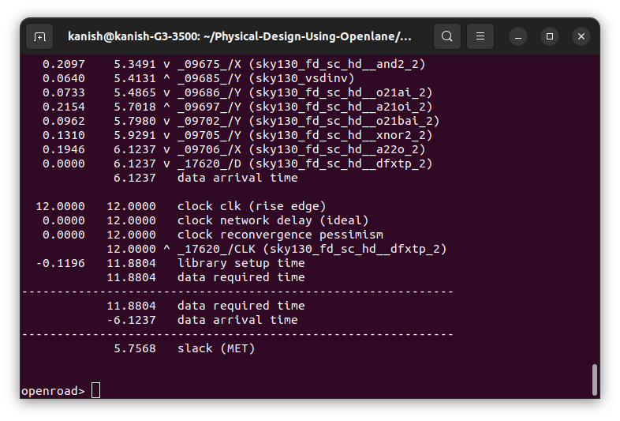

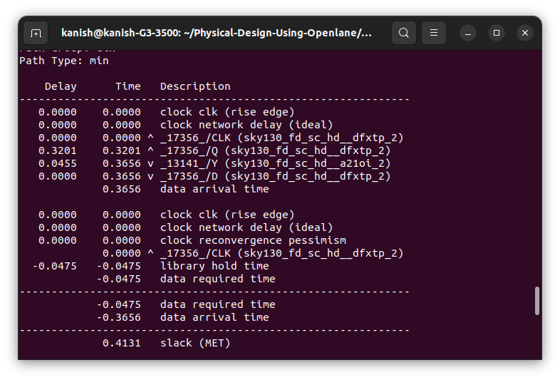


## Day 5 : Final steps in RTL2GDS
	
 # Maze Routing and Lee's algorithm

 Routing is the process of establishing a physical connection between two pins. Algorithms designed for routing take source and target pins and aim to find the most efficient path between them, ensuring a valid connection exists.

The Maze Routing algorithm, such as the Lee algorithm, is one approach for solving routing problems. In this method, a grid similar to the one created during cell customization is utilized for routing purposes. The Lee algorithm starts with two designated points, the source and target, and leverages the routing grid to identify the shortest or optimal route between them.

The algorithm assigns labels to neighboring grid cells around the source, incrementing them from 1 until it reaches the target (for instance, from 1 to 7). Various paths may emerge during this process, including L-shaped and zigzag-shaped routes. The Lee algorithm prioritizes selecting the best path, typically favoring L-shaped routes over zigzags. If no L-shaped paths are available, it may resort to zigzag routes. This approach is particularly valuable for global routing tasks.

However, the Lee algorithm has limitations. It essentially constructs a maze and then numbers its cells from the source to the target. While effective for routing between two pins, it can be time-consuming when dealing with millions of pins. There are alternative algorithms that address similar routing challenges.

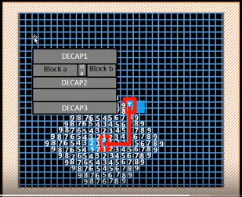

## Design Rule Check (DRC)

DRC verifies whether a design meets the predefined process technology rules given by the foundry for its manufacturing. DRC checking is an essential part of the physical design flow and ensures the design meets manufacturing requirements and will not result in a chip failure. It defines the Quality of chip. They are so many DRCs, let us see few of them

Design rules for physical wires

Minimum width of the wire, Minimum spacing between the wires, Minimum pitch of the wire To solve signal short violation, we take the metal layer and put it on to upper metal layer. we check via rules, Via width, via spacing.


## Power Distribution Network generation

Unlike the general ASIC flow, Power Distribution Network generation is not a part of floorplan run in OpenLANE. PDN must be generated after CTS and post-CTS STA analyses:

we can check whether PDN has been created or no by check the current def environment variable: ``` echo $::env(CURRENT_DEF)```

```
prep -design picorv32a -tag Run 12.07.10.11
gen_pdn

```


- Once the command is given, power distribution netwrok is generated.
- The power distribution network has to take the ```design_cts.def``` as the input def file.
- Power rings,strapes and rails are created by PDN.
- From VDD and VSS pads, power is drawn to power rings.
- Next, the horizontal and vertical strapes connected to rings draw the power from strapes.
- Stapes are connected to rings and these rings are connected to std cells. So, standard cells get power from rails.
- The standard cells are designed such that it's height is multiples of the vertical tracks /track pitch.Here, the pitch is 2.72. Only if the above conditions are adhered it is possible to power the standard cells.
- There are definitions for the straps and the rails. In this design, straps are at metal layer 4 and 5 and the standard cell rails are at the metal layer 1. Vias connect accross the layers as required.

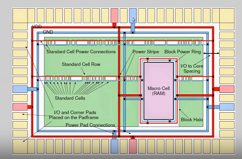

## Routing

 In the realm of routing within Electronic Design Automation (EDA) tools, such as both OpenLANE and commercial EDA tools, the routing process is exceptionally intricate due to the vast design space. To simplify this complexity, the routing procedure is typically divided into two distinct stages: Global Routing and Detailed Routing.

The two routing engines responsible for handling these two stages are as follows:

- **Global Routing**: In this stage, the routing region is subdivided into rectangular grid cells and represented as a coarse 3D routing graph. This task is accomplished by the "FASTE ROUTE" engine.

- **Detailed Routing**: Here, finer grid granularity and routing guides are employed to implement the physical wiring. The "tritonRoute" engine comes into play at this stage. "Fast Route" generates initial routing guides, while "Triton Route" utilizes the Global Route information and further refines the routing, employing various strategies and optimizations to determine the most optimal path for connecting the pins.

## Key Features of TritonRoute

- **Initial Detail Routing**: TritonRoute initiates the detailed routing process, providing the foundation for the subsequent routing steps.

- **Adherence to Pre-Processed Route Guides**: TritonRoute places significant emphasis on following pre-processed route guides. This involves several actions:

   - **Initial Route Guide Analysis**: TritonRoute analyzes the directions specified in the preferred route guides. If any non-directional routing guides are identified, it breaks them down into unit widths.

   - **Guide Splitting**: In cases where non-directional routing guides are encountered, TritonRoute divides them into unit widths to facilitate routing.

   - **Guide Merging**: TritonRoute merges guides that are orthogonal (touching guides) to the preferred guides, streamlining the routing process.

   - **Guide Bridging**: When it encounters guides that run parallel to the preferred routing guides, TritonRoute employs an additional layer to bridge them, ensuring efficient routing within the preprocessed guides.
   - Assumes route guide for each net satisfy inter guide connectivity Same metal layer with touching guides or neighbouring metal layers with nonzero  vertically overlapped area( via are placed ).each unconnected termial i.e., pin of a standard cell instance should have its pin shape overlapped by a routing guide( a black dot(pin) with purple box(metal1 layer))
   - 


In summary, TritonRoute is a sophisticated tool that not only performs initial detail routing but also places a strong emphasis on optimizing routing within pre-processed route guides by breaking down, merging, and bridging them as needed to achieve efficient and effective routing results.

Works on MILP(Mixed Integer linear programming) based panel routing scheme with Intra-layer parallel and Inter-layer sequential routing framework

# TritonRoute problem statement

```
Inputs : LEF, DEF, Preprocessed route guides
Output : Detailed routing solution with optimized wire length and via count
Constraints : Route guide honoring, connectivity constraints and design rules.

```
The space where the detailed route takes place has been defined. Now TritonRoute handles the connectivity in two ways.

Access Point(AP) : An on-grid point on the metal of the route guide, and is used to connect to lower-layer segments, pins or IO ports,upper-layer segments.
Access Point Cluster(APC) : A union of all the Aps derived from same lower-layer segment, a pin or an IO port, upper-layer guide.

**TritonRoute run for routing**

Make sure the CURRENT_DEF is set to pdn.def

Start routing by using

```
run_routing
```
The options for routing can be set in the config.tcl file.
The optimisations in routing can also be done by specifying the routing strategy to use different version of TritonRoute Engine. There is a trade0ff between the optimised route and the runtime for routing.

For the default setting picorv32a takes approximately 30 minutes according to the current version of TritonRoute.

Here drc violation is zero:


## Layout in magic tool post routing: 

The design can be viewed on magic within results/routing directory. Run the follwing command in that directory:

```
magic -T /home/kanish/OpenLane/vsdstdcelldesign/libs/sky130A.tech lef read tmp/merged.nom.lef def read results/routing/picorv32a.def &

```

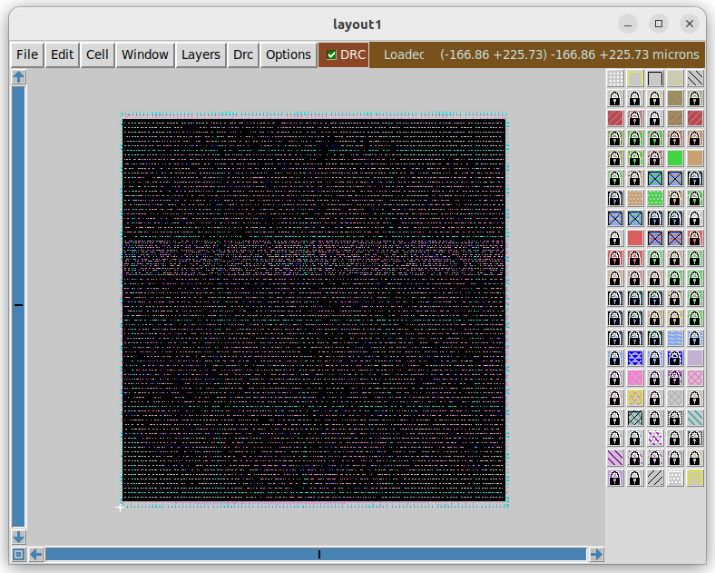


## Word of Thanks
I sciencerly thank **Mr. Kunal Gosh**(Founder/**VSD**) for helping me out to complete this flow smoothly.


[Acknowledgement Section]:#
## Acknowledgement
1.  Kunal Ghosh, VSD Corp. Pvt. Ltd.
2.  Sumanto Kar, Sr. Project Technical Assistant , IIT Bombay
3.  Alwin Shaju, Colleague IIITB
4.  Adam Teman, Associate Professor at Bar-Ilan University in Ramat Gan, Israel 

[Reference Section]:#
## References
1. https://www.eng.biu.ac.il/temanad/digital-vlsi-design/
2. https://github.com/bhargav-vlsi/Physical_design_open_lane
3. https://github.com/alwinshaju08/Physicaldesign_openlane